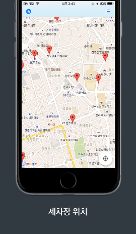
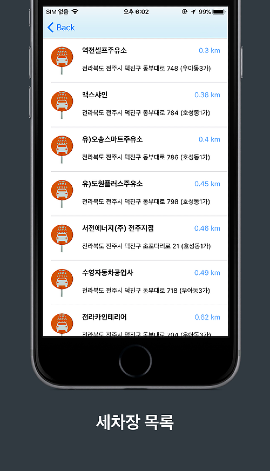
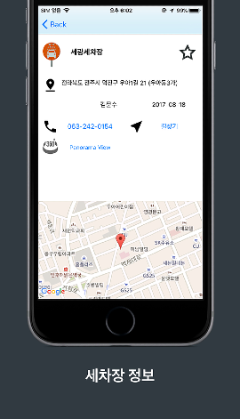
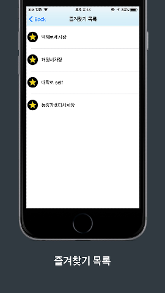
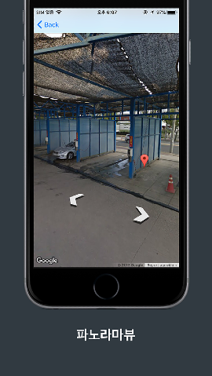

# JeonjuCarWash

  

  

> 전주시 세차장 현황을 지도로 확인하고 가까운 세차장을 찾을 수 있도록 도와줍니다.  
> 
> 세차장 주소, 전화번호, 파노라마뷰(Panorama View)를 확인할 수 있으며,  
> 
> 애플지도를 이용해 세차장까지 길찾기를 할 수 있습니다.

  

## Previews

  

## Tech stack & Open-source libraries
- Minimum IOS version 10.0
- [Swift4](https://swift.org/blog/swift-4-0-released/) based

- Libraries
  - [GoogleMaps](https://developers.google.com/maps/documentation/ios-sdk/overview) - Google Maps service

